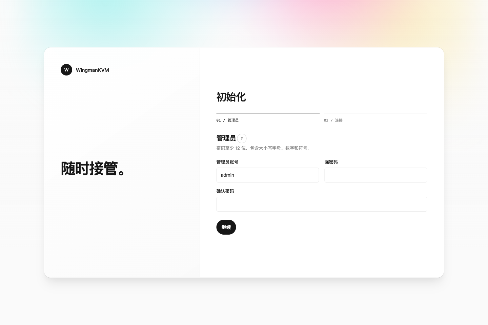
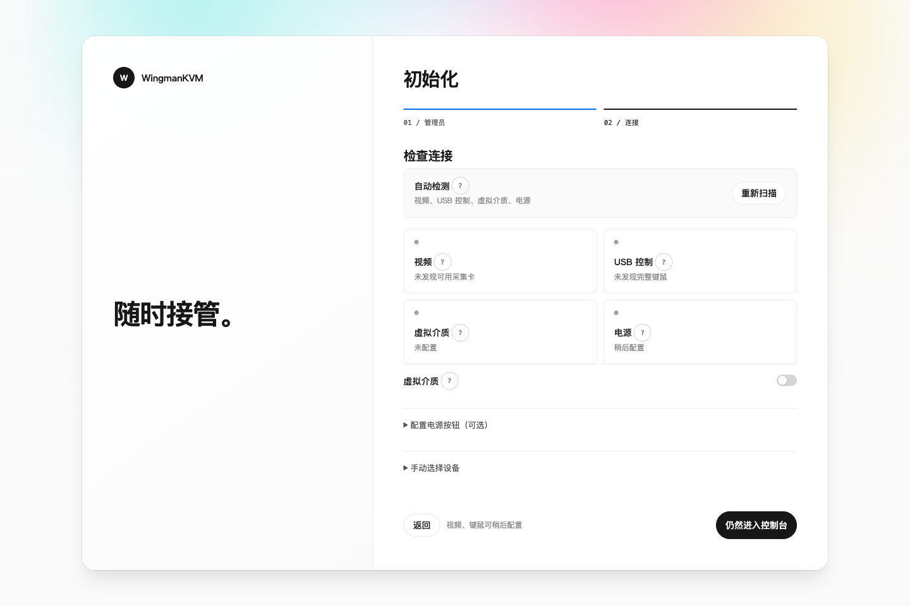
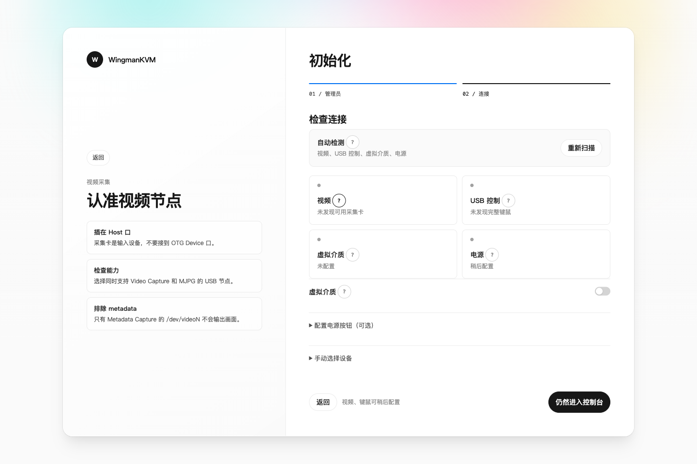

# WingmanKVM

一个轻量、开放配置的网页 KVM。它运行在 Linux 主机或开发板上，把 USB HDMI 采集卡、USB HID Gadget、GPIO 继电器和可选的 USB Mass Storage Gadget 组合起来，让你在浏览器中完成：

- 查看被控机画面；
- 转发键盘、鼠标和滚轮；
- 使用绝对坐标指针，让网页中的指针位置与远端画面保持一致；
- 通过 GPIO 短按或长按电源键；
- 打开一个运行在 KVM 主机本机的真实交互式终端；
- 上传 ISO/IMG 并挂载为被控机的虚拟介质。

WingmanKVM 是 Rust 单二进制程序。视频默认走 V4L2 MJPEG 直通，不经过 OpenCV 解码和再次编码，尽量把 CPU 和内存留给被控机控制本身。

## 支持范围

### 软件平台

程序可以在 Linux `x86_64`、`aarch64`（ARM64）和 `armv7` 等架构上构建运行。常见的 RK3399、树莓派、其他 ARM SBC，以及带有相应 USB 控制器的 x86 小主机都可以作为 KVM 主机。

不过，**完整的 USB KVM 功能取决于硬件，而不是 CPU 架构**。当前官方安装流程面向完整 KVM，并要求主机能够提供 Linux UDC：

- 必须有可用或可切换到 Device 模式的 USB Device/OTG 控制器（Linux UDC），才能完成官方安装并把键盘、鼠标或存储功能暴露给被控机；
- 必须有 USB Host 口连接 HDMI 采集卡；
- GPIO 电源控制需要一条接到继电器或电源按键的可用 GPIO；
- 没有 OTG/UDC 的普通 x86 主机不在当前一键安装支持范围内。手工启动二进制可用于源码开发和诊断，但不是受支持的纯视频生产部署方式。

网页中可以不启用 GPIO 电源控制或虚拟介质，但官方 Gadget service 当前仍创建完整的 HID 与 Mass Storage 复合设备，因此内核需要提供相应 function 支持。

### 硬件组成

| 模块 | 作用 | 必需性 |
| --- | --- | --- |
| USB HDMI 采集卡 | 提供被控机画面，暴露为 `/dev/video*` | 必需 |
| USB OTG/Device 控制器 | 让 KVM 主机模拟 USB 外设 | 键鼠/虚拟介质必需 |
| HID Gadget 键盘 | BIOS/UEFI 和系统键盘输入 | 键盘控制必需 |
| HID Gadget 相对鼠标 | BIOS/UEFI 兼容的鼠标输入 | 建议保留 |
| HID Gadget 绝对指针 | 桌面系统中的坐标同步 | 可选，推荐 |
| GPIO + 继电器 | 短按/长按被控机电源 | 电源控制可选 |
| Mass Storage Gadget LUN | 向被控机挂载 ISO/IMG | 虚拟介质可选 |

## 工作方式

```text
被控机 HDMI ──> USB HDMI 采集卡 ──> /dev/video*
                                      │ V4L2 mmap / MJPEG
                                      ▼
浏览器 <── HTTP MJPEG / WebSocket 终端 ── WingmanKVM
   │                                  │
   ├── 键盘/鼠标请求 ────────────────> /dev/wingmankvm-*
   ├── 电源请求 ────────────────────> GPIO / gpioset
   └── ISO/IMG ──> Mass Storage LUN ─> USB OTG ──> 被控机
```

官方安装器会部署独立的 `wingmankvm-gadget.service`，在系统启动时创建并维护 Boot Keyboard、Boot Mouse、Absolute Pointer 和 Mass Storage LUN，同时提供稳定的 `/dev/wingmankvm-*` 设备链接。WingmanKVM 应用服务只负责扫描和使用这些接口，不会在处理网页请求时反复重建 Gadget。已有自定义 Gadget 的设备也可以继续沿用自己的启动服务，详见[部署说明](docs/DEPLOYMENT.md)。

## 功能

- V4L2 mmap 采集，支持 MJPEG 直通和可选 JPEG 重编码。
- 视频采集预设：4K、1440p、1080p、720p、480p、自定义；帧率可选 60/30/25/24/15 FPS 或自定义。
- 采集分辨率与浏览器显示缩放分离，支持适应窗口、原始像素、拉伸，以及像素锐利/平滑插值。
- Boot Keyboard、Boot Relative Mouse 和 Absolute Pointer；HID 写入非阻塞并带有界超时。
- 绝对指针按视频内容区域换算坐标，黑边区域不会误发鼠标请求。
- 可拖动、缩放、全屏的远程画面窗口；视频和终端在同一个工作区顶部切换。
- 内嵌 xterm.js + PTY 的本机终端，支持 ANSI、光标、颜色、方向键、Ctrl 组合键和窗口尺寸同步。
- GPIO 短按/长按电源脉冲（依赖 libgpiod 2.x `gpioset`）。
- ISO/IMG 上传；ISO 强制只读，IMG 可作为读写或只读 U 盘；支持正常弹出和强制弹出。
- 首次启动向导、硬件扫描、管理员认证、Argon2id 密码哈希和会话限时。
- 所有硬件路径均可在网页中手动指定，不依赖固定的 `/dev/video5` 或 `/dev/hidg0` 编号。

## 快速开始

### 1. 准备 Linux 二进制

如果直接在 Debian、Ubuntu 或 Armbian 设备上构建：

```bash
sudo apt update
sudo apt install -y \
  build-essential pkg-config clang libclang-dev linux-libc-dev \
  libgpiod-tools v4l-utils

git clone https://github.com/XiNian-dada/WingmanKVM.git
cd WingmanKVM
cargo build --release --locked
```

需要近期的 stable Rust（包含 `cargo`）。也可以在另一台机器上构建同架构的 Linux 二进制，再把二进制和仓库中的 `deploy/` 目录复制到 KVM 主机；目标板不需要安装 Rust。macOS ARM64 与 Linux ARM64 架构名称相同，但二进制格式不同，Apple Silicon 用户应使用 Linux ARM64 容器或交叉编译工具链。完整示例见[部署说明](docs/DEPLOYMENT.md)。

### 2. 一条命令安装

```bash
sudo ./deploy/install.sh --binary ./target/release/wingmankvm
```

安装器会幂等地完成以下工作：

- 创建 `wingmankvm` 服务用户、`wingman` 终端用户和硬件权限组；
- 安装 udev 规则、systemd unit、密码同步 helper 和持久化状态目录；
- 创建键盘、相对鼠标、绝对指针与虚拟介质 Gadget；
- 在内核提供设备号映射时创建稳定 HID 设备链接，并授权 Mass Storage LUN；
- 启用并启动 Gadget 与 WingmanKVM 服务。

重复运行安装器会更新二进制和托管文件，同时保留已有的管理员认证、网页配置、镜像和 `/etc/wingmankvm/gadget.env`。

如果 `/sys/class/udc` 存在但暂时没有可用 UDC，通常是 OTG 口尚未切到 Device 模式。可以先只安装文件，再配置板级 USB role 或指定 UDC：

```bash
sudo ./deploy/install.sh --binary ./target/release/wingmankvm --no-start
sudoedit /etc/wingmankvm/gadget.env
sudo systemctl enable --now wingmankvm-gadget.service wingmankvm.service
```

`gadget.env` 的可用项和不同板卡的排查方法见[部署说明](docs/DEPLOYMENT.md)。一个 UDC 同时只能由一个 Gadget 管理；启用 WingmanKVM 前应停用占用同一 UDC 的旧脚本或服务。

如果硬件或内核根本没有 Linux UDC，`--no-start` 也不能把它变成可用的 KVM 主机；当前官方安装不提供 video-only 模式。

### 3. 打开首次设置向导

安装完成时，安装器会把默认路由使用的源 IPv4 放在第一位，并列出检测到的其他非回环 IPv4 地址。首次安装的地址会带上仅初始化时有效的一次性令牌，例如：

```text
install.sh: open WingmanKVM: http://192.168.1.20:8080/#setup=...
install.sh: the first-run link contains the one-time setup token
```

直接打开显示的一次性地址即可；页面会自动读取令牌并立即从地址栏清除，不需要手工复制。如果终端输出已经丢失，再从日志找回地址或令牌：

```bash
sudo journalctl -u wingmankvm -b --no-pager
```

设置管理员账号和强密码；密码至少 12 位，并包含大写字母、小写字母、数字和符号。页面会在后台扫描硬件，进入“检查连接”后直接显示推荐结果：

- 优先选择支持 MJPEG 的 V4L2 采集节点；
- 优先使用官方 Gadget service 创建的稳定 HID 路径；
- 自动回填唯一可用的 Mass Storage LUN；
- 使用安装器创建的默认镜像目录。

普通用户通常只需确认检测结果并选择是否启用电源控制、虚拟介质。自定义 Gadget 的 HID 角色自动判定依赖 configfs 中的 `subclass`、`protocol`、`report_length` 以及 function `dev` 到 `/dev/hidg*` 的设备号映射；旧内核缺少 `dev` 属性时，需要在“高级设置”中人工指定路径。GPIO 扫描无法判断继电器实际接线，因此仍需结合开发板原理图确认线路，并在网页选择高电平或低电平触发。

初始化只有“管理员”和“检查连接”两步。每个硬件区域旁边的 `?` 会把左侧介绍区切换成对应的精简 Guide，不会挤占右侧表单。

| 创建管理员 | 自动检查连接 |
| --- | --- |
| [](docs/images/setup-account.png) | [](docs/images/setup-detection.png) |

[](docs/images/setup-guide.png)

创建管理员后 setup token 立即失效，网页密码也会同步给本机终端用户 `wingman`。不要把密码写进命令行或 systemd unit。

## 如何找到并配置硬件

首次向导和“设备”面板会自动扫描并回填明确的候选项。以下命令主要用于自动检测出现多个结果、板卡未暴露设备，或你正在使用自定义 Gadget 时排查。

### HDMI 采集卡

```bash
v4l2-ctl --list-devices
ls -l /dev/video*
v4l2-ctl -d /dev/video5 --list-formats-ext
```

选择实际对应的 `/dev/videoX`。优先选择支持 `MJPG` 的节点，并在网页中先使用“设备默认”测试；如果采集卡列出了多个节点，不要仅凭编号猜测用途。

### USB HID Gadget

```bash
ls -l /dev/hidg*
find /sys/kernel/config/usb_gadget -path '*/functions/hid.*' -type d -print
cat /sys/class/udc/*/uevent 2>/dev/null
```

建议的 function 参数：

| 接口 | `subclass` | `protocol` | `report_length` |
| --- | ---: | ---: | ---: |
| Boot Keyboard | `1` | `1` | `8` |
| Boot Relative Mouse | `1` | `2` | `4` |
| Absolute Pointer | `0` | `0` | `6` |

官方 Gadget 服务会按这些参数和匹配的 report descriptor 创建接口，并通过 function `dev` 的 major:minor 映射提供 `/dev/wingmankvm-keyboard`、`/dev/wingmankvm-mouse` 和 `/dev/wingmankvm-absolute` 三个稳定链接。首次向导优先使用这些稳定路径。自定义 Gadget 只有在 configfs 参数和设备号映射完整时才能自动确认角色；部分旧内核不提供 function `dev`，此时应在高级设置中核对并填写实际 `/dev/hidgN`。默认指针模式为“自动”：有绝对接口时优先使用绝对坐标，没有时回退到相对鼠标。BIOS/UEFI 通常需要保留 Boot Keyboard 和 Boot Relative Mouse。

如果没有任何 `/dev/hidg*`，先检查内核是否启用了 USB Gadget/configfs，以及 Gadget 是否已经绑定到 UDC：

```bash
test -d /sys/kernel/config/usb_gadget && echo configfs-ok
ls -l /sys/class/udc
cat /sys/kernel/config/usb_gadget/*/UDC 2>/dev/null
```

先检查 `wingmankvm-gadget.service` 日志和 `/etc/wingmankvm/gadget.env`。手工检查或接入自定义 configfs Gadget 的方法放在[部署说明的高级故障排查章节](docs/DEPLOYMENT.md#9-高级自定义-gadget-检查)。

### GPIO 电源线

使用 GPIO 字符设备工具查找芯片和线路：

```bash
gpiodetect
gpioinfo gpiochip1
gpioset --version
```

网页中填写 `gpiochipN` 和线路号（line offset），并选择继电器是高电平还是低电平触发。线路号不是排针上的物理脚位编号；请以 `gpioinfo` 和开发板原理图为准，并先断开被控机电源或使用万用表验证。`gpioset` 需要 libgpiod 2.x，短按和长按默认分别为 500 ms 与 5 s。

### USB Mass Storage LUN

官方 Gadget 服务会创建 Mass Storage function，首次向导通常会自动找到唯一的 `lun.0`。使用自定义 Gadget 或自动检测失败时再运行：

```bash
find /sys/kernel/config/usb_gadget \
  -path '*/functions/mass_storage.*/lun.0' -type d -print
```

如果存在多个 LUN，在“虚拟介质”的高级设置中选择实际连接到被控机的目录。建议在网页中保留默认镜像目录 `/var/lib/wingmankvm/images`。自定义目录不仅要给 `wingmankvm` 用户读写权限，还必须通过 `wingmankvm.service` 的 `ReadWritePaths=` 放行；只在网页中填写路径并不够，配置方法见[部署说明](docs/DEPLOYMENT.md#虚拟介质不可用)。只接受 `.iso` 和 `.img`：ISO 默认作为只读光驱，IMG 默认作为可读写 U 盘，也可以手动切换为只读或选择光驱/磁盘模式。

读写 IMG 与真实 U 盘一样需要安全弹出。先在被控机中卸载或弹出，再在 WingmanKVM 中点击“弹出”；强制弹出可能损坏镜像文件系统。正在提供给被控机的 IMG 不得同时在 KVM 主机上以读写方式挂载。

## 配置和状态

官方安装的状态目录为 `/var/lib/wingmankvm`。源码开发或手工诊断时可以通过环境变量临时覆盖：

```bash
WINGMANKVM_STATE_DIR=/path/to/state ./target/release/wingmankvm
```

生产部署如需改动路径，应通过 systemd override 同时调整环境变量和 `ReadWritePaths=`，不要只改网页配置。

其中包括：

```text
config.json   硬件和视频/输入配置（0600）
auth.json     管理员账号与 Argon2id 哈希（0600）
images/       上传的 ISO/IMG
```

常用检查接口：

```bash
curl -fsS http://127.0.0.1:8080/healthz
curl -i http://127.0.0.1:8080/api/bootstrap
```

主要登录后接口包括 `/video_feed`、`/api/status`、`/api/devices/scan`、`/api/key`、`/api/mouse/*`、`/api/terminal/ws`、`/power` 和 `/api/media/*`。接口细节以当前源码和网页行为为准。

## 安全注意事项

WingmanKVM 能够控制电源、键盘、鼠标并向 USB 总线提供磁盘镜像，应当按基础设施控制面来部署：

- 不要把 8080 端口直接暴露到公网；优先使用可信管理网、WireGuard/Tailscale，或在 Caddy/Nginx 后终止 HTTPS。
- 首次启动后立即设置强密码；不要分享 setup token、会话 Cookie 或 systemd 日志中的敏感信息。
- 官方安装器会创建专用 `wingmankvm` 用户和 `wingmankvm-hw` 组，并安装 udev 权限规则。生产硬件可以继续按 VID/PID 收窄 [`deploy/99-wingmankvm.rules`](deploy/99-wingmankvm.rules) 的视频设备范围。
- GPIO 自动扫描只能列出芯片和线路，不能判断电气连接。变更线路前先确认继电器逻辑和 `active_high`。
- ISO 始终只读；IMG 可以读写。弹出读写 IMG 前先让被控机卸载文件系统，且不要让 KVM 主机和被控机同时读写同一个镜像。
- 网页终端是 KVM 主机本机 shell，不是被控机终端；请按最小权限配置 `wingman` 用户。

## 当前边界

当前版本有意保持简单：

- 不提供网页中的任意 USB descriptor 或 Gadget 拓扑编辑器；
- 不提供 H.264/WebRTC 视频管线；
- 不包含多用户/细粒度 RBAC；
- 终端字符输入按 PTY/键盘事件工作，不负责把任意 Unicode 文本转换成目标机键盘布局；
- x86 主机若没有 USB Device/OTG 控制器，不能提供 USB HID/存储模拟。

## 文档与许可证

- 设计与实现边界：[`DESIGN.md`](DESIGN.md)
- Linux、Gadget、udev 和 systemd 部署：[`docs/DEPLOYMENT.md`](docs/DEPLOYMENT.md)
- Firefly RK3399 从零部署实例：[`docs/RK3399_GUIDE.md`](docs/RK3399_GUIDE.md)
- 许可证：[`MIT`](LICENSE)

欢迎提交 issue、硬件适配经验和改进建议。
